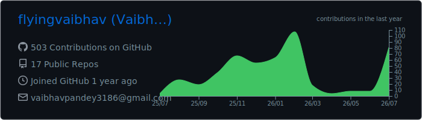
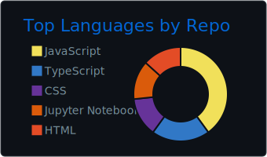
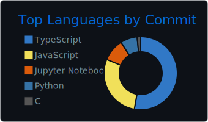
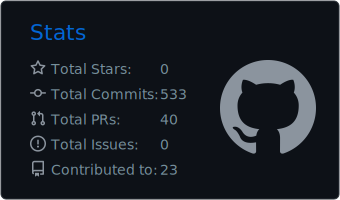
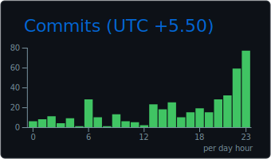

<div align="center">


<p align="center">
  
</p>

# Vaibhav Pandey

### Engineering scalable systems where backend, distributed computing, and AI converge.

<p>
Computer Science Undergraduate • Backend Engineer • AI Systems Builder • Open Source Enthusiast
</p>

</div>

---

## Connect with Me

<p align="center">

<a href="https://vaibhavpportfolio.netlify.app/">

</a>

<a href="https://www.linkedin.com/in/vaibhavpandey0987654321/">

</a>

<a href="https://github.com/flyingvaibhav">

</a>

<a href="https://leetcode.com/u/vaibhavpandey138/">

</a>


  
  
  


</p>

---

# About Me

I'm **Vaibhav Pandey**, a Computer Science undergraduate passionate about designing scalable software systems that solve practical engineering problems.

My work primarily revolves around backend engineering, distributed systems, developer tooling, artificial intelligence, and modern cloud-native architectures.

I enjoy transforming ideas into production-inspired software by combining clean architecture, efficient algorithms, scalable APIs, and thoughtful system design.

---

## Engineering Domains

- Backend Engineering
- Distributed Systems
- Artificial Intelligence
- System Design
- Cloud Computing
- API Design
- Developer Tooling
- Full Stack Development
- Open Source

---

# 💻 Technology Stack

<p align="center">


### Languages


</p>

<p align="center">

### Backend Development


</p>

<p align="center">

### Frontend Development


</p>

<p align="center">

### Databases


</p>

<p align="center">

### AI / Machine Learning


</p>

<p align="center">

### Cloud • DevOps


</p>

<p align="center">

### Developer Tools


</p>

---

# ⚙️ Engineering Expertise

<table>
<tr>
<td width="50%" valign="top">

### Backend Engineering

- REST API Design
- Authentication & Authorization
- JWT • OAuth • RBAC
- Microservices
- WebSockets
- Server-Sent Events
- Async Programming
- Concurrent Programming
- Distributed Systems

</td>

<td width="50%" valign="top">

### Software Engineering

- Clean Architecture
- SOLID Principles
- Design Patterns
- System Design
- Database Design
- Performance Optimization
- Unit Testing
- CI/CD
- Agile Development

</td>
</tr>
</table>

<table>
<tr>
<td width="50%" valign="top">

### Artificial Intelligence

- Large Language Models
- Prompt Engineering
- RAG
- Computer Vision
- NLP
- Speech-to-Text
- Text-to-Speech
- Model Evaluation
- YOLO

</td>

<td width="50%" valign="top">

### Cloud & Infrastructure

- Docker
- GitHub Actions
- AWS
- Linux
- Nginx
- Deployment Automation
- Monitoring
- Logging
- Reverse Proxy

</td>
</tr>
</table>

---
# # 🚀 Featured Projects

<table>

<tr>

<td width="50%" valign="top">

## Last Mile Delivery Tracker

**Smart Logistics & Shipment Tracking Platform**

A scalable logistics and shipment management platform featuring customer, delivery agent, and admin portals. Supports smart dispatch, automated pricing, order tracking, email notifications, secure authentication, and responsive dashboards.

**Domain**

`Logistics` • `Full Stack` • `SaaS`

**Tech**

Next.js • TypeScript • MongoDB • Clerk Authentication • Tailwind CSS • Nodemailer

[Repository](https://github.com/flyingvaibhav/last-mile-delivery-tracker)

</td>

<td width="50%" valign="top">

## S.A.R.G.A.M

**Scalable Music Streaming Platform**

A production-inspired music streaming platform built using microservices architecture with secure authentication, Redis caching, API Gateway, and scalable backend services.

**Domain**

`Distributed Systems` • `Backend Engineering`

**Tech**

TypeScript • Node.js • Express.js • MongoDB • Redis • JWT • Microservices

[Repository](https://github.com/flyingvaibhav/S.A.R.G.A.M-microservices-project)

</td>

</tr>


<tr>

<td width="50%" valign="top">

## Disaster Drone Management System

**AI Disaster Response Platform**

An AI-powered disaster response system using YOLO-based real-time survivor detection, drone simulation, mission planning, and emergency coordination. Includes live video streaming, GPS survivor logging, route optimization, and mission control dashboard.

**Domain**

`Artificial Intelligence` • `Computer Vision` • `Robotics`

**Tech**

Python • FastAPI • YOLO • OpenCV • SQLite • Computer Vision

[Repository](https://github.com/flyingvaibhav/disaster-drone-management-system)

</td>


<td width="50%" valign="top">

## LetsKraack

**AI Career Preparation Platform**

AI-powered interview preparation platform featuring mock interviews, resume analysis, speech-to-text processing, LLM evaluation, personalized learning, and career assistance workflows.

**Domain**

`Artificial Intelligence` • `EdTech`

**Tech**

Next.js • TypeScript • PostgreSQL • AssemblyAI • Gemini • AWS Polly

[Repository](https://github.com/flyingvaibhav/Let-s-Krack)

</td>

</tr>


<tr>

<td width="50%" valign="top">

## TreeSense

**AI-Based Green Cover Analysis System**

AI-powered tree detection and counting solution using aerial imagery. Supports YOLOv8 model training, evaluation, visualization, and ONNX deployment for forest inventory and environmental monitoring.

**Domain**

`Artificial Intelligence` • `Computer Vision` • `Environmental Tech`

**Tech**

Python • YOLOv8 • OpenCV • ONNX • Machine Learning

[Repository](https://github.com/flyingvaibhav/TreeSensing)

</td>


<td width="50%" valign="top">

## AI Support ChatBOT

**Intelligent Conversational Assistant**

AI-powered chatbot application designed to provide automated support through intelligent conversations, contextual responses, and modern frontend-backend integration.

**Domain**

`Artificial Intelligence` • `Chatbots`

**Tech**

TypeScript • JavaScript • AI APIs • Web Development

[Repository](https://github.com/flyingvaibhav/AI-Support-ChatBOT)

</td>

</tr>

</table>


---

# 📦 Other Notable Projects

- 💬 **SyncVerse** — Real-time chat application built with MERN stack, JWT authentication, and WebSockets supporting secure instant messaging, online presence, and responsive communication.

[Repository](https://github.com/flyingvaibhav/Syncverse)


- ✅ **Tasklyst** — Lightweight dependency-free task management application built with HTML, CSS, and JavaScript featuring LocalStorage persistence, animations, accessibility support, and responsive UI.

[Repository](https://github.com/flyingvaibhav/Tasklyst)


- 🚁 **Flood Survival Detection Drone** — Computer vision based emergency detection system designed for disaster monitoring and survivor identification.

[Repository](https://github.com/flyingvaibhav/flood-survival-detection-drone)


- 🧠 **Shortest Path Detector** — Algorithm visualization project implementing graph traversal and shortest path algorithms for problem-solving and learning.

[Repository](https://github.com/flyingvaibhav/Shortest-Path-detector)


- 🍔 **FoodieBot** — Food-related conversational application integrating interactive user experiences and chatbot workflows.

[Repository](https://github.com/flyingvaibhav/FoodieBot)


- 🌐 **SkillBridge** — Full-stack platform focused on connecting skills, learning resources, and user collaboration.

[Repository](https://github.com/flyingvaibhav/SkillBridge)


- 📝 **Lexora** — Frontend-focused web application exploring modern UI development and responsive design principles.

[Repository](https://github.com/flyingvaibhav/lexora)


- 📚 **AI Course Generation Platform** — AI-assisted platform for generating educational content and personalized learning resources.

[Repository](https://github.com/flyingvaibhav/ai-course-generation)


# 📊 GitHub Analytics

<div align="center">


</div>

<div align="center">


</div>

---

# 📈 GitHub Summary

<div align="center">



</div>

<br>

<div align="center">





</div>

<br>

<div align="center">





</div>

---
# 📈 Contribution Activity

<div align="center">


</div>

---

# 🏆 GitHub Trophies

<p align="center">


</p>

---

# 📊 Development Metrics
<div align="center">
  
</div>

---

---


# 💻 Competitive Programming

<div align="center">


</div>

<br>

<div align="center">

| Platform | Highlights |
|-----------|------------|
| 🟠 LeetCode | 500+ Problems Solved • Contest Rating ~1434 |
| 🟢 HackerRank | Problem Solving • SQL |
| ⚪ GeeksforGeeks | DSA Practice |

</div>

---

# 🎯 Engineering Highlights

- 🏆 Winner — **PSIT Tech Expo 2024** (Fire & Smoke Detection System)
- 🏆 Winner — **PSIT Tech Expo 2025** (LetsKraack AI Platform)
- 🚀 Built **12+** software engineering projects.
- 🧠 Solved **500+** DSA problems.
- ⚙️ Designed enterprise-grade authentication systems with RBAC and MFA.
- 🤖 Developed AI systems using LLMs, Computer Vision, Speech-to-Text, and Retrieval-Augmented Generation.
- ☁️ Built cloud-ready applications using Docker, GitHub Actions, AWS, and PostgreSQL.
- 🛰️ Worked on distributed systems, asynchronous processing, and workflow orchestration.

---

# 🌱 Currently Exploring

```text
✓ Distributed Systems

✓ Event-Driven Architecture

✓ Spring Boot

✓ Microservices

✓ Kubernetes

✓ Cloud Native Development

✓ AI Agents

✓ Platform Engineering

✓ High Performance Backend Systems
```

---

# 🤝 Open Source Goals

In 2026, I'm focusing on:

- Building production-quality open-source software.
- Contributing to developer tooling and backend ecosystems.
- Writing technical documentation and architecture guides.
- Publishing reusable libraries and engineering utilities.
- Collaborating on distributed systems and AI infrastructure projects.

---


# 🐍 Contribution Snake

<p align="center">
  
</p>

---

### "Build systems that scale. Write code that lasts."

⭐ If you like my work, consider following my journey.


### Thanks for visiting!


</div>
